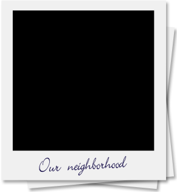
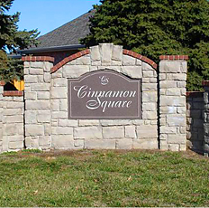
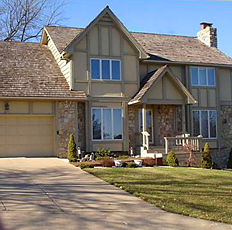
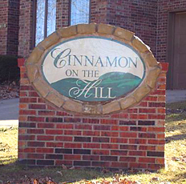
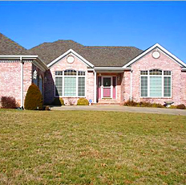
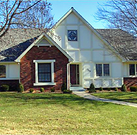

    

    

        <h2 class="welcome">Welcome to Cinnamon Square Property Owner&acute;s Association</h2>
        
We're dedicated to improving the quality of life in our neighborhood through community service, 
        a proactive response to livability issues, and developing a sense of togetherness. We hope this 
        site keeps our neighbors informed, active, and in touch. Contact us at 
        <a href="mailto:cspoabkpr@gmail.com">cspoabkpr@gmail.com</a> (Cinnamon Square and Cinnamon on the Hill) or 
        <a href="mailto:cinnamontownhomes@gmail.com">cinnamontownhomes@gmail.com</a> (Cinnamon Townhomes) for 
        more information or if you'd like to see something on our website.

        
        

            

                
                
                
                
                
            

        

        

    

    

    

        

            <h3><i class="fa fa-home"></i> The Neighborhood</h3>
            
CSPOA includes the communities of <strong>Cinnamon Square</strong>, <strong>Cinnamon on the Hill</strong>, and <strong>Cinnamon Townhomes</strong>. Nestled on the east side of Springfield, Missouri, CSPOA is conveniently located near sevearal major trafficways and many shops and restaurants. CSPOA also takes great care of its community by particpation in the City of Springfield&acute;s <a class="external" href="http://www.springfieldmo.gov/172/Crime-Prevention" target="_blank">Active Neighborhood Watch program</a>.

        

        

            <h3><i class="fa fa-users"></i> Your Community</h3>
            <ul>
                <li><a href="/about#the-board">Board of Directors</a></li>
                <li><a href="/about#declarations-and-bylaws">Declarations and Bylaws</a></li>
                <li><a href="/about#amenities">Amenities</a></li>
                <li><a href="/faq">FAQ's</a></li>
                <li><a href="/about#forms">Forms</a></li>
                <li><a href="/contact">Contact Us</a></li>
                <li><a href="http://www.springfieldchamber.com/" target="_blank">Springfield Chamber of Commerce</a></li>
                <li><a href="http://springfieldpublicschoolsmo.org/" target="_blank">Springfield Public Schools</a></li>
            </ul>
        

        

            
            
            <ul class="socialmedia">
                <li>
                    
                </li>
                <li>
                    
                </li>
            </ul>
        

    

